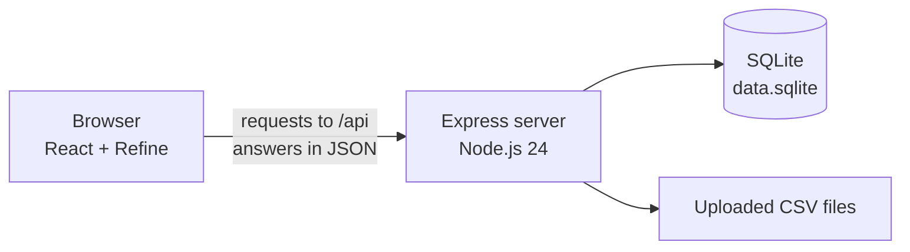

# Architecture

Orotrack is two programs that talk to each other over HTTP:

- **The client** is a React app that runs in the browser. It draws the pages
  and never touches the database.
- **The server** is an Express app that runs on Node.js. It checks who is
  asking, reads and writes the database, and stores uploaded files.

On the live site, the database file and the uploaded files sit on a Railway
volume, a disk that keeps its contents across deployments.

## Development and production

| | Development | Production (Railway) |
|---|---|---|
| Client | Vite dev server on port 5173 | Built into `client/dist` |
| Server | Express on port 3000 | Express on the port Railway assigns |
| How they connect | Vite forwards `/api` requests to port 3000 (`client/vite.config.js`) | Express serves the files in `client/dist` and the API from one address |
| Data folder | `data/` at the top of the project | `/data`, the Railway volume |

## The client

All client code is in `client/src`:

| Folder | Contents |
|---|---|
| `providers/` | How Refine signs in and calls the API |
| `components/` | Pieces used by more than one page: the top bar, the sign-in layout, the logo |
| `pages/` | One folder per resource, plus the pages that belong to no resource (Home, Login, Help) |

`App.jsx` sets up Refine with three things:

- **The auth provider** (`providers/authProvider.js`) tells Refine how to
  sign in, sign out, check whether a token exists, react to a 401, and look
  up the signed-in user's role.
- **The data provider** (`providers/dataProvider.js`) tells Refine how to
  call the API. Its five functions (`getList`, `getOne`, `create`, `update`,
  `deleteOne`) map to the standard routes of each resource, and each one
  attaches the login token.
- **The resources** list what the app manages: participants, uploads,
  attempts, and users.

Pages use Refine hooks (`useList`, `useForm`, `useUpdate`, `useDelete`,
`useLogin`, `useLogout`, `usePermissions`). Three places call the API with
`fetch` directly, because their requests don't fit the data provider's five
functions: uploading a file, resetting a password, and loading trends.

### Pages

| Address | File | Who sees it | Purpose |
|---|---|---|---|
| `/login` | `pages/Login.jsx` | Anyone signed out | Sign in |
| `/help` | `pages/Help.jsx` | Anyone | How the app works and the CSV format |
| `/` | `pages/Home.jsx` | Signed in | Sends admins to `/users` and therapists to `/participants` |
| `/users` | `pages/users/UserList.jsx` | Admin | List accounts; rename, reset password, delete |
| `/users/create` | `pages/users/UserCreate.jsx` | Admin | Create a therapist account |
| `/participants` | `pages/participants/ParticipantList.jsx` | Therapist | List and delete participants |
| `/participants/create`, `/participants/edit/:id` | `pages/participants/ParticipantCreate.jsx`, `ParticipantEdit.jsx` | Therapist | Add or change a participant |
| `/upload` | `pages/uploads/Upload.jsx` | Therapist | Upload a session CSV and list uploaded files |
| `/attempts` | `pages/attempts/AttemptList.jsx` | Therapist | Every attempt, with filters |
| `/trends` | `pages/trends/Trends.jsx` | Therapist | Summary numbers and a chart for one participant |

Signed-in pages share `components/Layout.jsx`, which shows the links for the
user's role. Hiding links is a convenience only. The server enforces every
rule.

## The server

| File or folder | Contents |
|---|---|
| `index.js` | Connects the middleware and routes, serves the client, starts listening |
| `db.js` | Opens the database, creates and migrates the tables |
| `setupAdmin.js` | Creates or updates the admin account at startup |
| `middleware/` | `requireAuth.js` and `requireAdmin.js` |
| `routes/` | One file per resource, plus `auth.js` for signing in |

`index.js` sets up Express in this order:

1. `express.json()`, which reads JSON request bodies into `req.body`.
2. `setupAdmin()`, which runs once at startup.
3. The sign-in routes from `routes/auth.js`: `POST /api/login`, which needs
   no token, and `GET /api/me`, which applies `requireAuth` itself.
4. The resource routes, each behind `requireAuth`: `/api/participants`,
   `/api/uploads`, `/api/attempts`, `/api/trends`.
5. The account routes, behind `requireAuth` and `requireAdmin`: `/api/users`.
6. A JSON 404 for unknown `/api` addresses.
7. The built client files, then `index.html` for any other address, so that
   React Router can handle page addresses such as `/participants` in the
   browser.
8. An error handler that answers 500 for unexpected errors.

## Accounts, roles, and tokens

- **Passwords** are stored only as bcrypt hashes. The original password is
  never saved.
- **Roles:** each user has the role `admin` or `user`. The first user row is
  the administrator. `setupAdmin.js` keeps it in sync with the `ADMIN_EMAIL`
  and `ADMIN_PASSWORD` settings every time the server starts, and names it
  "Administrator". Every other account is created by the administrator and
  has the role `user`.
- **Tokens:** a successful sign-in returns a JSON Web Token containing the
  user's id, email, and role, signed with `JWT_SECRET` and valid for seven
  days. The browser keeps it in local storage and sends it in the
  `Authorization` header as `Bearer <token>`.
- **`middleware/requireAuth.js`** verifies the token's signature and expiry
  and puts its contents in `req.user`. A missing, altered, or expired token
  gets 401.
- **`middleware/requireAdmin.js`** runs after `requireAuth` on the account
  routes and answers 403 unless `req.user.role` is `admin`.

## Private data

Every participant row stores the id of the user who owns it. Every query
that reads or changes participant data includes the signed-in user's id,
taken from the token:

- Participant queries use `WHERE id = ? AND user_id = ?`.
- Upload, attempt, and trend queries check `participants.user_id`, either
  through a join or by checking the participant first.

A row that belongs to someone else behaves as if it doesn't exist: reads
return 404, and updates and deletes change nothing. The administrator owns no
participants and has no route that reads other users' data.

## Request examples

**Signing in:** the sign-in page calls `useLogin`, which runs `login` in the
auth provider. That sends the email and password to `POST /api/login`. The
server compares the password with the stored hash and returns a token. The
browser stores it, and Refine opens the user's first page.

**Renaming an account:** the Users page asks for the new name and calls
`useUpdate`. Refine runs `update` in the data provider, which sends
`PUT /api/users/:id` with the token. `requireAuth` and `requireAdmin` let the
request through only for the administrator, the route saves the name, and
Refine reloads the list.

**Uploading a file:** the Upload page sends the participant id and the file
as multipart form data to `POST /api/uploads`. Multer saves the file to the
uploads folder. The route checks that the participant belongs to the user,
reads the file, checks the header for the five required columns, then saves
one `uploads` row and one `attempts` row per line.
