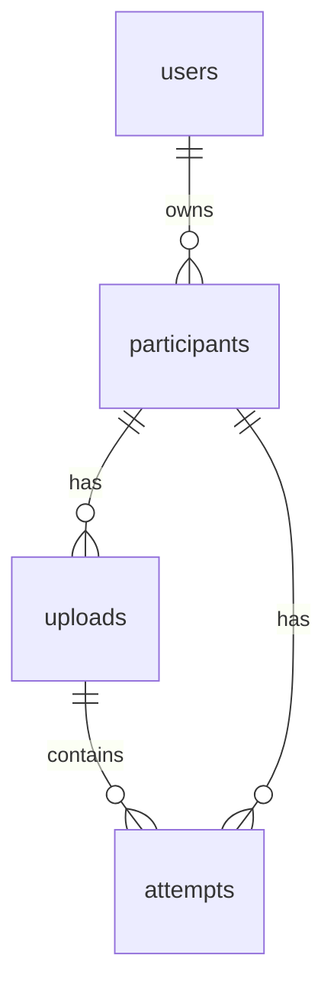

# Database

Orotrack uses SQLite through Node's built-in `node:sqlite` module. The whole
database is one file, `data.sqlite`, in the data folder:

- On the live site, `DATA_DIR` is `/data`, a Railway volume.
- On a developer's computer, `DATA_DIR` is not set, so the server uses
  `../data` relative to the `server` folder, which is the `data` folder at the
  top of the project.

`server/db.js` opens the file and creates any missing tables every time the
server starts. All tables use `CREATE TABLE IF NOT EXISTS`, so starting the
server never deletes data.

## Tables

### users

One row per account.

| Column | Type | Rules |
|---|---|---|
| `id` | INTEGER | Primary key |
| `email` | TEXT | Not null, unique |
| `password_hash` | TEXT | Not null. A bcrypt hash, never the password. |
| `name` | TEXT | Not null, default empty text |
| `role` | TEXT | Not null, default `user`. Either `admin` or `user`. |

The row with the lowest id is the administrator. At startup the server sets
its email, password hash, name, and role from the `ADMIN_EMAIL` and
`ADMIN_PASSWORD` settings, or creates it if the table is empty.

### participants

One row per child.

| Column | Type | Rules |
|---|---|---|
| `id` | INTEGER | Primary key |
| `code` | TEXT | Not null, unique across all accounts |
| `age_group` | TEXT | Not null |
| `target_sounds` | TEXT | Not null. Empty text when not given. |
| `user_id` | INTEGER | References `users(id)`. The owner. |

### uploads

One row per uploaded CSV file.

| Column | Type | Rules |
|---|---|---|
| `id` | INTEGER | Primary key |
| `participant_id` | INTEGER | Not null, references `participants(id)`, cascade on delete |
| `original_name` | TEXT | Not null. The file's name on the user's computer. |
| `stored_name` | TEXT | Not null. The random name it was saved under. |
| `row_count` | INTEGER | Not null. Number of data rows. |
| `uploaded_at` | TEXT | Not null. ISO date and time, in UTC. |

The original file is kept in the `uploads` folder inside the data folder,
under `stored_name`.

### attempts

One row per line of an uploaded CSV.

| Column | Type | Rules |
|---|---|---|
| `id` | INTEGER | Primary key |
| `upload_id` | INTEGER | Not null, references `uploads(id)`, cascade on delete |
| `participant_id` | INTEGER | Not null, references `participants(id)`, cascade on delete |
| `timestamp` | TEXT | Not null. As written in the CSV, `YYYY-MM-DD HH:MM:SS`. |
| `exercise` | TEXT | Not null. Any text, such as `/r/ initial`. |
| `result` | TEXT | `correct`, `incorrect`, or null for an invalid attempt |
| `confidence_score` | REAL | Not null, 0 to 1 |
| `input_validity` | TEXT | Not null. `valid`, `low_input`, or `no_speech`. |

## Deleting

SQLite enforces the links between tables only when `PRAGMA foreign_keys = ON`
is set, which `db.js` does at startup.

| When this is deleted | What happens |
|---|---|
| A participant | Its uploads and attempts are deleted by cascade |
| An upload | Its attempts are deleted by cascade |
| A user | The `DELETE /api/users/:id` route deletes the user's participants first, which cascades to their uploads and attempts, then deletes the user |

The link from participants to users has no cascade, so the database refuses
to delete a user who still owns participants. That is why the route deletes
the participants first.

Deleting rows does not delete the original CSV files from disk.

## Migrations

`CREATE TABLE IF NOT EXISTS` never changes a table that already exists, so
columns added after the first version are added separately. Each migration
checks the table's columns with `PRAGMA table_info` and runs `ALTER TABLE`
only if the column is missing, so it runs once per database.

| Table | Column | Added for | Existing rows get |
|---|---|---|---|
| participants | `user_id` | Private data per account | The first user, the administrator |
| users | `name` | The Users page | Empty text |
| users | `role` | Admin accounts | `user`. The startup block then sets the first user to `admin`. |
